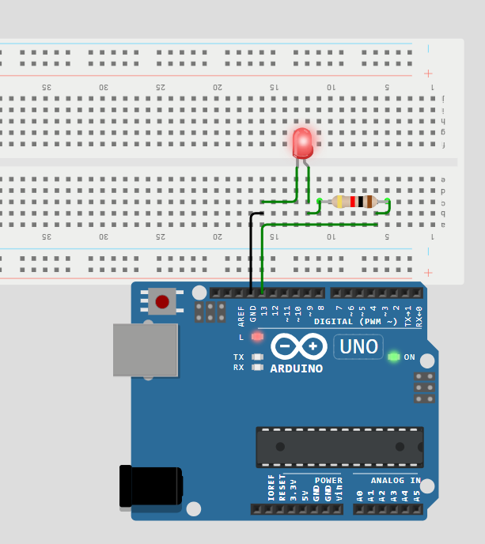
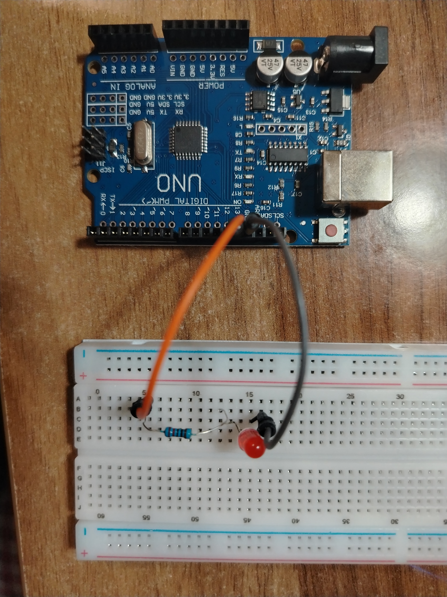

# Arduino Blink Project

Мини-проект для отработки навыков работы с Arduino: от симуляции в Wokwi до реальной сборки на макетной плате.

**Что сделано:**
- Схема спроектирована и протестирована в симуляторе Wokwi (см. фото ниже).
- Реальная сборка проверена на макетной плате (см. фото ниже).
- Код основан на стандартном примере `Blink` из Arduino IDE — я разобрала каждую строку и добавила комментарии для наглядности.

**Что использовано:**
- Плата Arduino Uno
- Красный светодиод
- Резистор 220 Ом

**Схема в Wokwi**

**Фото реальной сборки:**

**Как запустить:**
1. Открыть скетч `blink.ino` в Arduino IDE.
2. Выбрать плату: Arduino Uno.
3. Загрузить скетч на плату.
